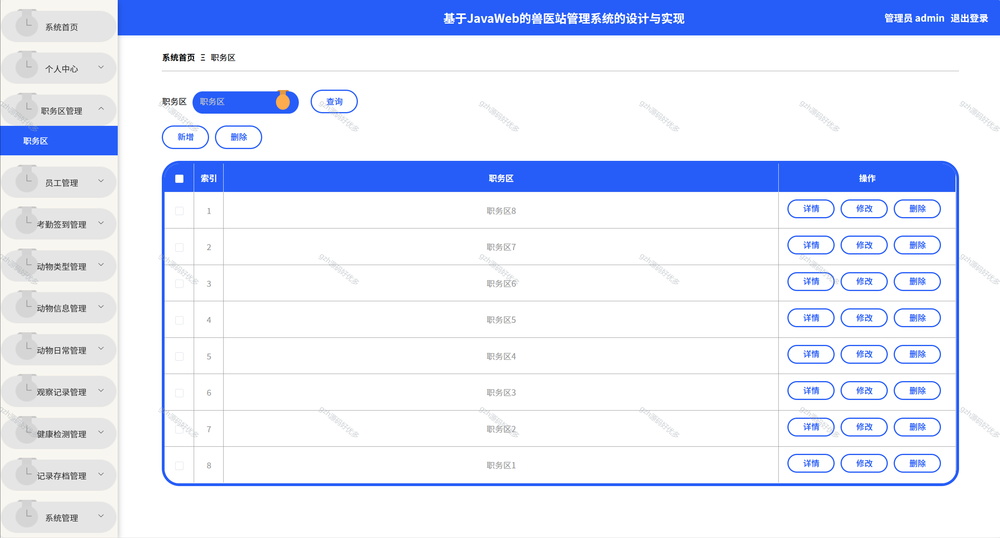
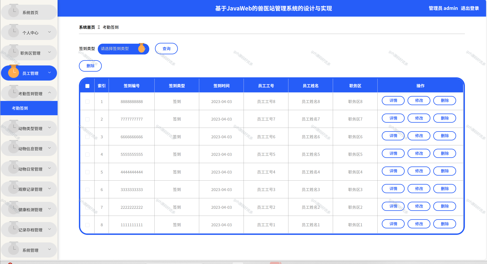
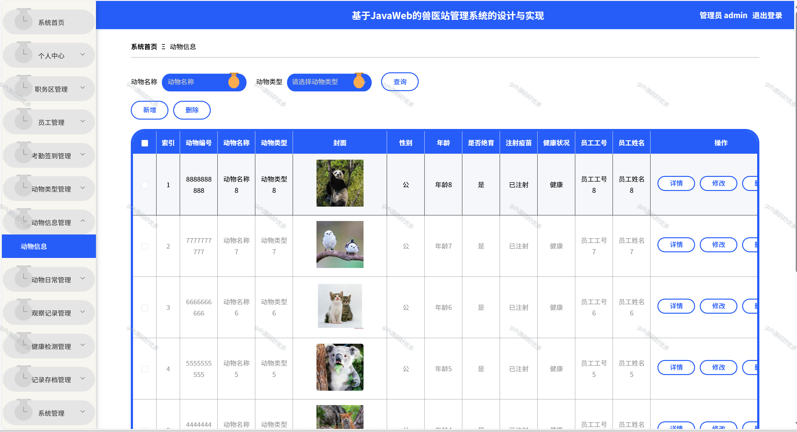
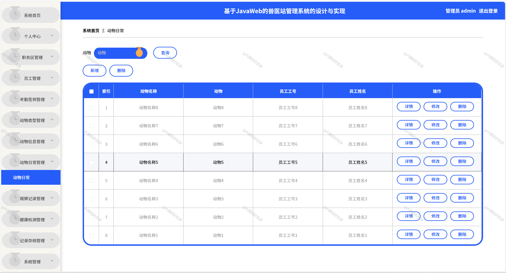
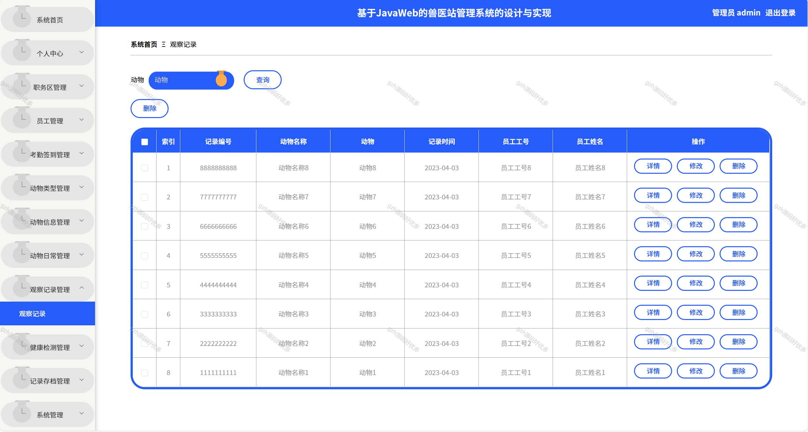
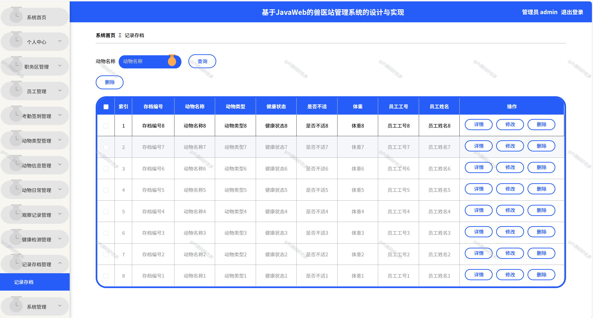
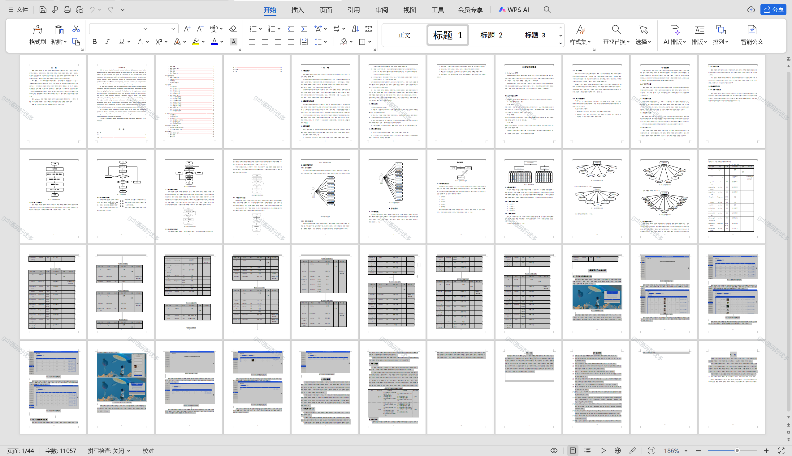

# springbootA227
springbootA227兽医站管理系统
  
## 查看主页获取源码

### 一、关键词
兽医站运营管理系统，兽医站信息管理系统，兽医诊所管理系统

### 二、作品包含
源码+数据库+设计文档万字+全套环境和工具资源+本地部署教程

### 三、项目技术
前端技术：Html、Css、Js、Vue2.0、Element-ui 
后端技术：Java、SpringBoot2.0、MyBatis

### 四、运行环境（以下版本亲测，其他版本未知，请自测）
开发工具：IDEA/eclipse  + VSCODE

数据库：MySQL5.7（最低要5.7版本）

数据库管理工具：Navicat10以上版本

环境配置软件： JDK1.8 + Maven3.6.3

前端Nodejs：14

浏览器：谷歌浏览器

### 五、项目介绍
项目编号：springbootA227

结合现有兽医站体系的特点，运用新技术，构建了以 springboot为基础的兽医站信息化管理体系。首先，以需求为依据，根据需求分析结果进行了系统的设计，并将其划分为管理员和员工二种角色和多个主要模块：员工、考勤签到、动物类型、动物信息、动物日常、观察记录、健康检测、记录存档等。使用目前市场主流的技术springboot框架进行项目构建，基于B/S架构开发模式，使用Java开发语言和MySQL数据库对系统进行高内聚低耦合的设计，最终完成了兽医站管理系统的实现。
基于springboot框架的兽医站管理系统为当前传统管理模式提供了一个高效、便捷、信息化的解决方案，这为后期兽医站管理系统的优化提供了新的方向。

### 六、运行截图

 
